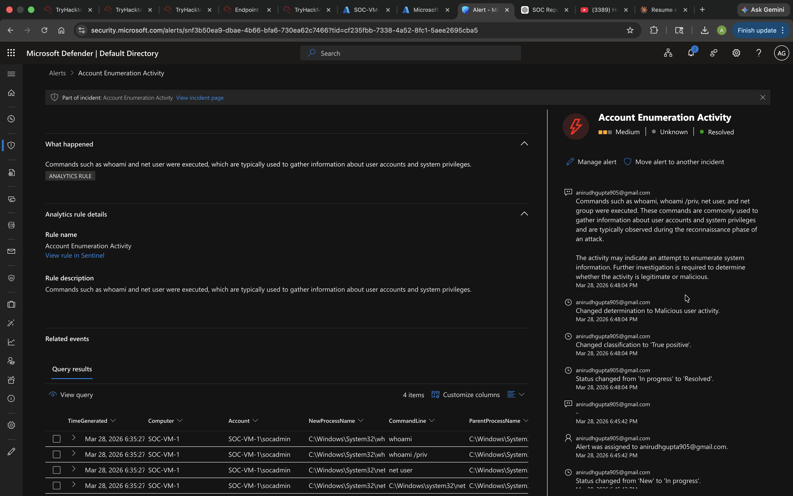

# Detection: Account Enumeration / Reconnaissance

## Overview
Detects execution of common enumeration commands used by attackers to map out 
users, groups, and system privileges after gaining initial access.

## Event ID
`4688` – A new process has been created

## Monitored Commands
`whoami` | `net user` | `net group` | `net localgroup`

## KQL Query
```kql
SecurityEvent
| where EventID == 4688
| where CommandLine has_any ("whoami", "net user", "net group", "net localgroup")
| project TimeGenerated, Account, Computer, CommandLine, ParentProcessName
| sort by TimeGenerated desc
```

## Query Explanation
- Filters for Event ID 4688 (new process creation)
- Checks command line arguments for known enumeration tools
- Surfaces the parent process to identify suspicious spawn chains
- Returns account, machine, and full command for analyst review

## Analytics Rule Configuration
| Setting | Value |
|---|---|
| Rule Name | Account Enumeration – Recon Commands Detected |
| Severity | Medium |
| Query Frequency | Every 5 minutes |
| Lookup Period | Last 5 minutes |
| Alert Threshold | Results > 0 |
| Entity Mapping | Account, Host |

## MITRE ATT&CK Mapping
| Field | Value |
|---|---|
| Tactic | Discovery |
| Technique | T1087 – Account Discovery |
| Technique | T1069 – Permission Groups Discovery |

## Screenshots




## Findings
Executed `whoami` and `net user` via CMD on the Windows VM. Alert fired within 
90 seconds. Sentinel incident included the full command line, executing account, 
and parent process (cmd.exe), providing sufficient context for triage without 
needing to pivot to additional logs.
