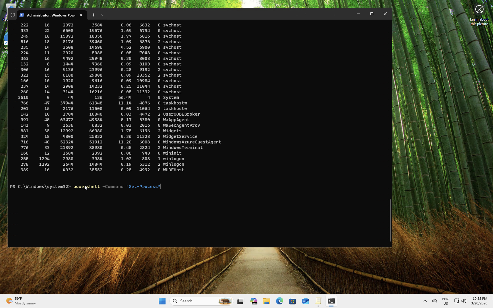
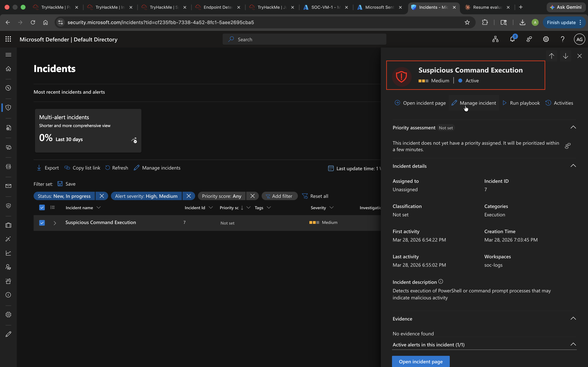
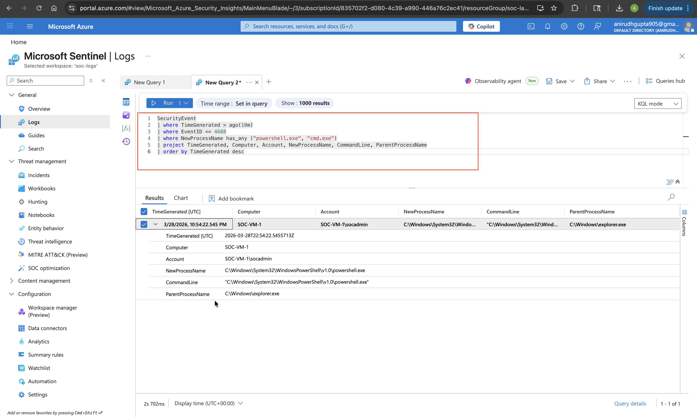

# Detection: Suspicious Command Execution (PowerShell / CMD)

## Overview
Detects spawning of PowerShell or CMD processes from unusual parent processes, 
which may indicate malicious script execution or living-off-the-land (LotL) behavior.

## Event ID
`4688` – A new process has been created

## KQL Query
```kql
SecurityEvent
| where EventID == 4688
| where Process has_any ("powershell.exe", "cmd.exe")
| where ParentProcessName !in ("explorer.exe", "services.exe", "svchost.exe")
| project TimeGenerated, Account, Computer, Process, ParentProcessName, CommandLine
| sort by TimeGenerated desc
```

## Query Explanation
- Filters for process creation events involving PowerShell or CMD
- Excludes common legitimate parent processes to reduce false positives
- Surfaces the parent process name to identify abnormal spawn chains
- Returns full command line for analyst investigation

## Analytics Rule Configuration
| Setting | Value |
|---|---|
| Rule Name | Suspicious Shell Execution – Abnormal Parent Process |
| Severity | High |
| Query Frequency | Every 5 minutes |
| Lookup Period | Last 5 minutes |
| Alert Threshold | Results > 0 |
| Entity Mapping | Account, Host, Process |

## MITRE ATT&CK Mapping
| Field | Value |
|---|---|
| Tactic | Execution |
| Technique | T1059 – Command and Scripting Interpreter |
| Sub-technique | T1059.001 – PowerShell |
| Sub-technique | T1059.003 – Windows Command Shell |

## Screenshots





## Findings
Launched PowerShell from a non-standard parent process on the Windows VM. Alert 
triggered immediately. Sentinel surfaced the full process tree, allowing rapid 
identification of the anomalous spawn chain without additional log pivoting.
