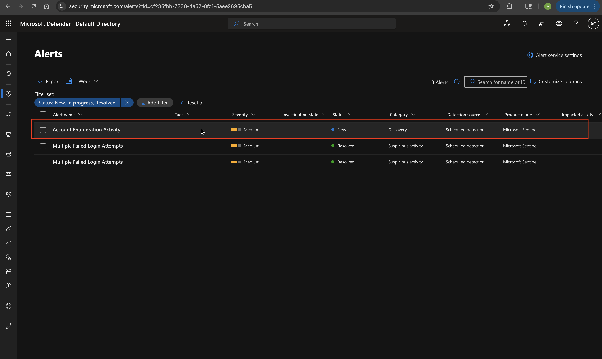
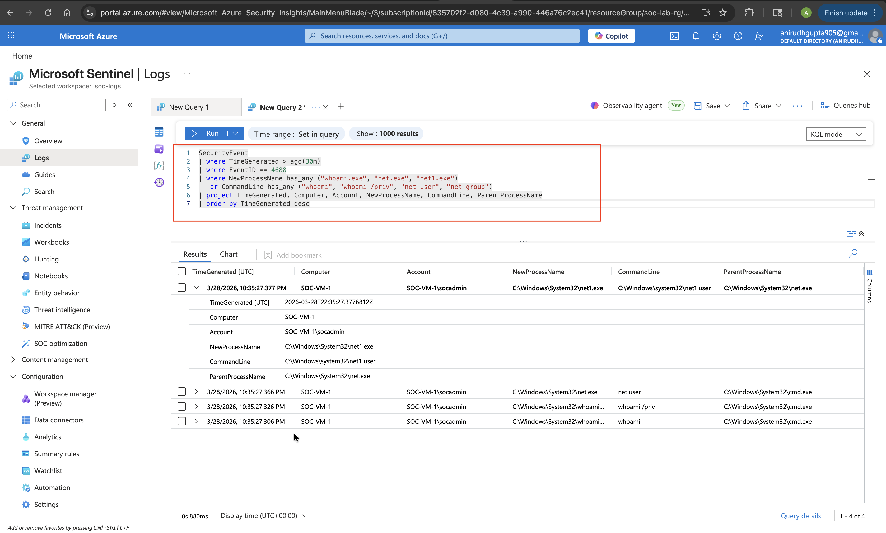
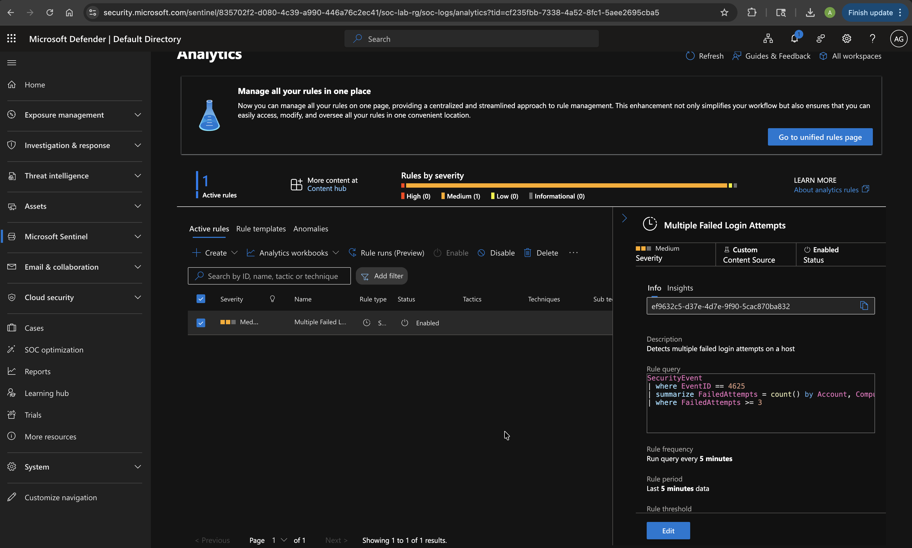
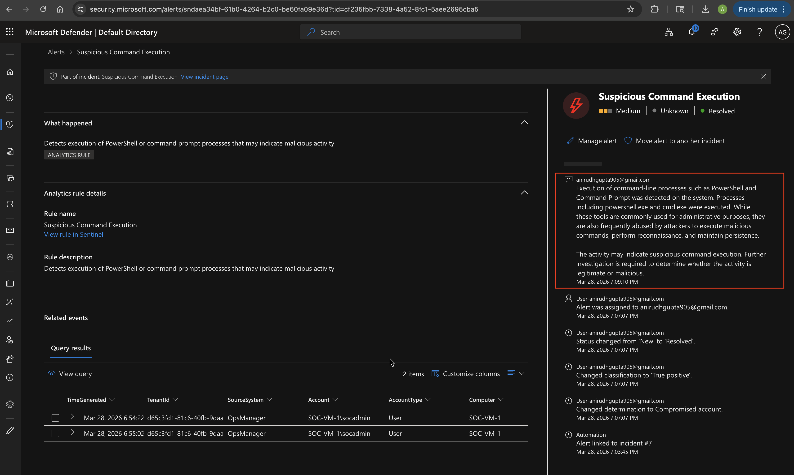

# Incident Report – SOC Lab Simulation

**Report Date:** 2026 
**Analyst:** Anirudh Gupta
**Environment:** Microsoft Sentinel / Azure Lab  
**Severity:** Medium  
**Status:** Resolved

---

## 1. Executive Summary
During a controlled lab simulation, three (3) detections were triggered across a 
Windows 11 virtual machine hosted in Azure. The simulated attack chain involved 
credential brute-forcing, post-access account enumeration, and suspicious 
command execution — mapping to the MITRE ATT&CK Credential Access, Discovery, 
and Execution tactics respectively. All alerts were triaged, investigated, and 
resolved within the lab environment.

---

## 2. Incident Timeline

| Time | Event |
|---|---|
| T+00:00 | Brute-force simulation initiated — repeated failed logins against local account |
| T+00:60 | Sentinel alert fired: 5+ failed logins within 5-minute window |
| T+02:00 | Enumeration commands executed (`whoami`, `net user`) via CMD |
| T+02:30 | Sentinel alert fired: Account enumeration activity detected |
| T+04:00 | PowerShell launched from non-standard parent process |
| T+04:10 | Sentinel alert fired: Suspicious command execution detected |
| T+06:00 | All three incidents reviewed and triaged in Sentinel incident queue |
| T+10:00 | Incidents closed as True Positive — Simulated Attack |

---

## 3. Affected Assets

| Asset | Details |
|---|---|
| Hostname | Azure Windows 11 VM |
| Account | Local test account |
| Log Source | Windows Security Event Log via Azure Monitor Agent |
| SIEM | Microsoft Sentinel |

---

## 4. Detection Summary

| Detection | Event ID | MITRE Tactic | MITRE Technique | Severity |
|---|---|---|---|---|
| Failed Login / Brute Force | 4625 | Credential Access | T1110 – Brute Force | Medium |
| Account Enumeration | 4688 | Discovery | T1087, T1069 | Medium |
| Suspicious Command Execution | 4688 | Execution | T1059.001, T1059.003 | High |

---

## 5. Investigation Notes

**Brute Force:**  
Five or more failed login attempts were recorded against the local account within 
a 5-minute window. No successful login followed the failed attempts. Source IP 
confirmed as internal lab machine — no lateral movement observed.

**Account Enumeration:**  
`whoami` and `net user` were executed via CMD shortly after the brute-force 
simulation. Parent process was `cmd.exe` launched manually. No automated script 
or scheduled task was identified as the trigger.

**Suspicious Command Execution:**  
PowerShell was launched from a parent process outside the expected baseline 
(`explorer.exe`, `services.exe`). Command line reviewed — no malicious payload 
identified in lab context. In a real environment this would warrant immediate 
escalation and endpoint isolation pending further review.

---

## 6. MITRE ATT&CK Chain
```
Initial Access
     ↓
Credential Access → T1110 (Brute Force)
     ↓
Discovery → T1087 (Account Discovery) | T1069 (Permission Groups Discovery)
     ↓
Execution → T1059.001 (PowerShell) | T1059.003 (Windows Command Shell)
```

---

## 7. Response & Containment

Since this was a controlled lab simulation, no containment actions were required. 
In a production environment, recommended response steps would include:

- Lock affected account after threshold breach
- Block source IP at firewall / NSG level
- Isolate endpoint pending full forensic review
- Escalate to Tier 2 if PowerShell execution is confirmed malicious
- Preserve logs and memory dump for forensic analysis

---

## 8. Conclusion

All three detections performed as expected. Alerts fired within 60–90 seconds of 
simulated activity. The detection rules successfully identified a realistic 
attack chain with sufficient log detail to support triage without additional 
tooling. This lab demonstrates end-to-end SOC workflow: log ingestion → 
detection → alert triage → investigation → documentation.

---

## 9. Screenshots

| Description | Preview |
|---|---|
| Sentinel Incident Queue |  |
| KQL Query Results |  |
| Analytics Rule Configuration |  |
| Incident Resolved |  |
